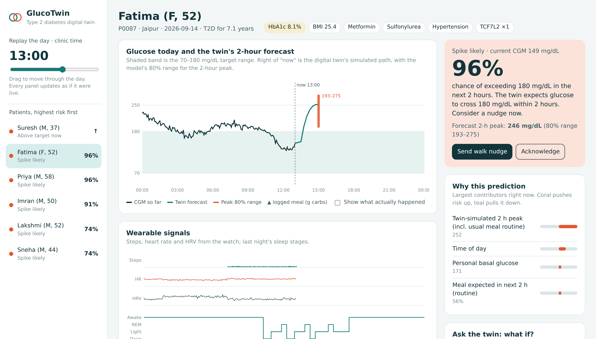
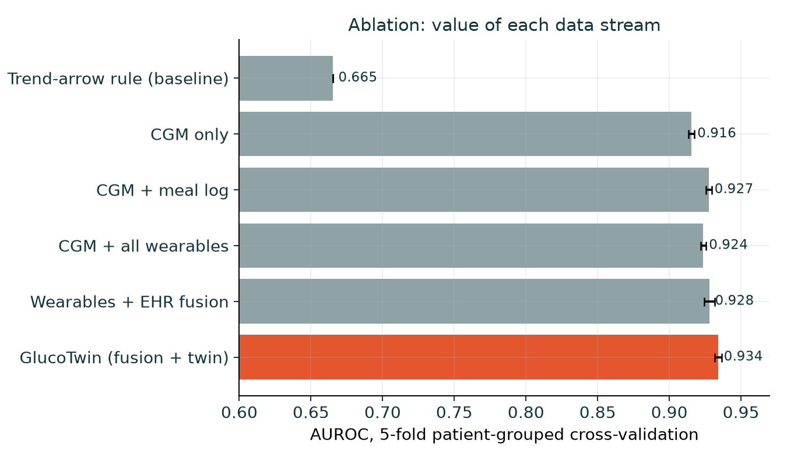
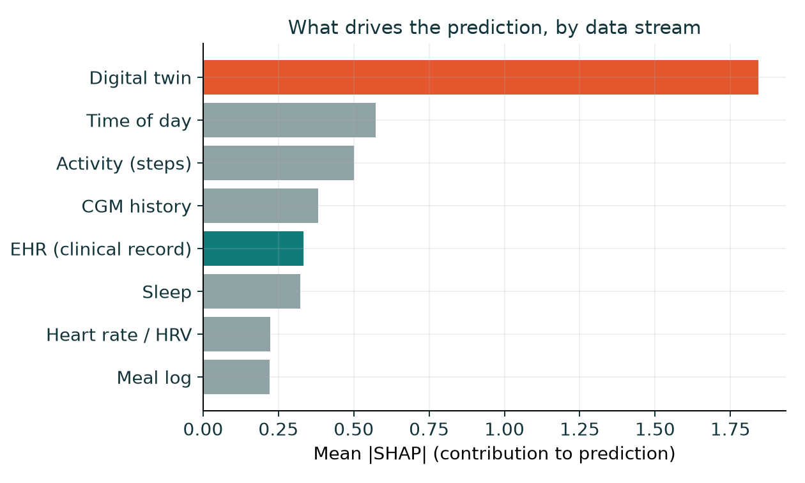
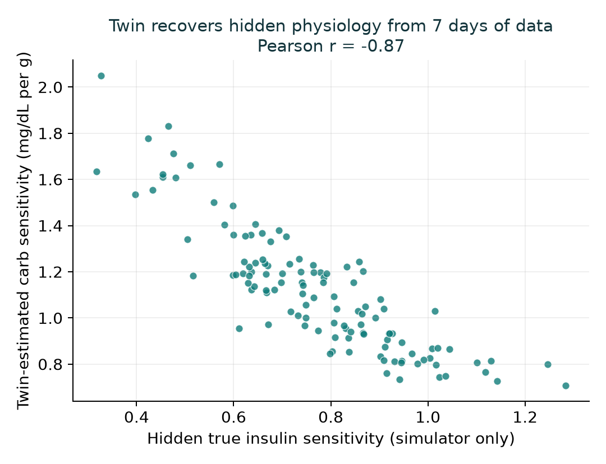
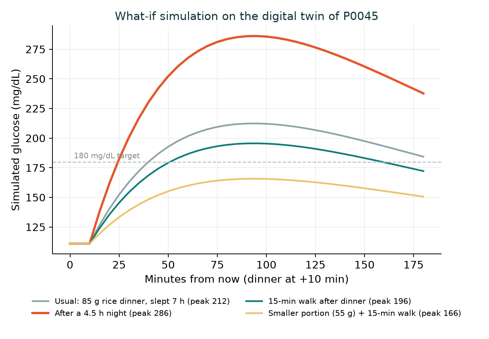

# GlucoTwin: a Type 2 diabetes digital twin that sees a glucose spike coming

> Happiest Health **Digital Twin Challenge 2026** · Phase 1: Prototype & Code Submission

GlucoTwin combines each patient's health record with their live wearable data. It builds a personalised virtual patient from them and uses it to predict whether glucose will go above **180 mg/dL in the next 2 hours**. It explains why each alert fired and lets a doctor test "what if?" changes on the twin before advising the real patient.

| | |
|---|---|
| **Demo video (2–5 min)** | `[UNLISTED YOUTUBE LINK]` |
| **Presentation** | [`docs/GlucoTwin_Presentation.pptx`](docs/GlucoTwin_Presentation.pptx) · [PDF](docs/GlucoTwin_Presentation.pdf) |
| **Architecture diagram** | [`docs/Architecture_Diagram.pdf`](docs/Architecture_Diagram.pdf) |
| **Clinician dashboard** | [`dashboard/GlucoTwin_Dashboard.html`](dashboard/GlucoTwin_Dashboard.html). Download it and open it in any browser; it works offline. |
| **Live dashboard** | [Open the dashboard](https://anshika-si.github.io/Healthbuddy_IIT_Kanpur/Healthbuddy_IIT_Kanpur/dashboard/GlucoTwin_Dashboard.html) |
| **License** | MIT (see [LICENSE](LICENSE)) |

---

## 1. Team details and college 

| Role | Name | College | Course & year | Email |
|---|---|---|---|---|
| Team leader | `Anshika Singh` | `IIT Kanpur` | `B.Tech Chemical Engineering, 4th yr` | `singha23@iitk.ac.in` |
| Member | `Raj Dipak Kamble` | `IIT Kanpur` | `B.Tech Mechanical Engineering, 4th yr` | `rajdk23@iitk.ac.in` |

**Team name:** `Healthbuddy` · **College:** `IIT Kanpur`

## 2. Project title

**GlucoTwin: a personalised, explainable digital twin for predicting post-meal glucose spikes in Type 2 diabetes**

## 3. Problem statement and healthcare use case

**Problem.**
- India has about **101 million adults with diabetes and 136 million with prediabetes** (ICMR-INDIAB, *Lancet Diabetes & Endocrinology*, 2023).
- Care is mostly reactive. HbA1c is checked every few months and averages away the daily post-meal spikes that drive complications.
- The main triggers are everyday events that nobody connects in real time: carbohydrate-heavy meals, late dinners, short sleep, stress and inactivity.
- A continuous glucose monitor (CGM) shows where glucose is *now*. Clinicians need to know where it is *going*, and what would change it.

**Use case (one condition, one outcome, as the brief asks).**
- **Condition:** Type 2 diabetes.
- **Adverse event:** CGM glucose above **180 mg/dL**, the ADA post-meal target, at any time in the **next 120 minutes**.
- **When predictions are made:** every 15 minutes, and only while glucose is still below 180. Every alert is therefore a genuine early warning, not a restatement of "it's already high".
- **Who uses it:**
  - **Patients** receive a timely, specific nudge ("a 15-minute walk after lunch will likely keep you in range").
  - **Doctors** get a triage list showing who is heading out of range and why.
  - **Care programmes** can target coaching where it moves outcomes.

## 4. Solution overview

GlucoTwin is a **hybrid digital twin**:

1. **Fuse.** Static EHR data (demographics, diagnoses, labs, medications, TCF7L2 genotype) and dynamic wearable data (CGM, heart rate, HRV, steps, sleep stages, meal log) are harmonised onto one 5-minute timeline.
2. **Simulate: the digital twin.**
   - During a one-week onboarding period, the twin learns **six physiological parameters** for each patient:
     - basal glucose
     - clearance rate
     - carbohydrate sensitivity
     - time-to-peak
     - sleep sensitivity
     - walking benefit
   - It also learns the patient's meal routine.
   - It then forward-simulates the next 2 hours and answers what-if questions (portion size, meal timing, a post-meal walk, sleep).
3. **Predict and explain.**
   - Gradient-boosted trees combine the raw fused signals with the twin's simulated trajectory.
   - Outputs:
     - a calibrated spike probability
     - a conformal 80% range for the 2-hour peak
     - SHAP-based reasons for every alert
4. **Dashboard.** A clinician view with:
   - a live risk triage list
   - a 24-hour CGM chart with the twin's forecast
   - the reasons behind each alert
   - what-if sliders
   - wearable and sleep panels, 7-day trends and the EHR

### The prototype fuses both required data streams

| Stream | Signals | Source in this prototype |
|---|---|---|
| **Static / historical EHR** | age, sex, BMI, waist, years since diagnosis, HbA1c, fasting glucose, LDL, triglycerides, eGFR, BP, hypertension, dyslipidaemia, family history, **TCF7L2 risk alleles**, metformin / sulfonylurea / DPP-4i / insulin | `src/data/generate_ehr.py` (synthetic Indian T2D cohort, FHIR-style JSON export with LOINC/SNOMED codes); **`src/data/synthea_adapter.py`** maps real Synthea CSV exports onto the same schema |
| **Dynamic / real-time** | CGM every 5 min, heart rate, HRV (RMSSD), steps, sleep stages (awake/light/deep/REM), app meal log (carbs) | `src/data/generate_wearables.py` (format mimics Apple Health / Google Fit / FreeStyle Libre exports) |

### Output: predicting an adverse event, plus a doctor-facing UI

- **Prediction:** "P(glucose > 180 mg/dL in the next 2 h) = 96%, forecast peak 246 mg/dL (80% range 193–275)".
- **Conceptual UI dashboard:** `dashboard/GlucoTwin_Dashboard.html` (screenshot below).



## 5. Technical stack, AI/ML models and frameworks

| Layer | Technology |
|---|---|
| Language | Python 3.12 |
| Data | pandas, NumPy; FHIR-style JSON; LOINC / SNOMED CT codes |
| Digital twin | Custom mechanistic model (`src/twin/glucotwin.py`): per-patient calibration with empirical-Bayes shrinkage to population priors; forward simulator; what-if engine |
| ML: spike risk | **LightGBM** gradient-boosted classifier, 57 fused features, early stopping on validation patients |
| ML: peak forecast | LightGBM **quantile regression** (q10 / q50 / q90) + **conformalised quantile regression** for a calibrated 80% interval |
| Explainability | **SHAP** TreeExplainer: per-prediction top drivers and per-stream attribution |
| Evaluation | scikit-learn: patient-level hold-out, 5-fold **GroupKFold** (grouped by patient), AUROC / AUPRC / Brier / calibration, clinical lead-time analysis |
| Visualisation | matplotlib (figures); self-contained **HTML + SVG + vanilla JS** dashboard (no server, no build step) |
| Docs | reportlab (architecture PDF), pptxgenjs (slides) |
| Tests | pytest (7 unit tests) |

### How the digital twin works

```
G(t) = Gb + R0·exp(−k·t) + Σ_meals CS · carbs · S · W · f(t + ago)

f(τ) = (τ/tpk)·exp(1 − τ/tpk)            meal absorption shape, peaks at tpk
S    = 1 + β_sleep · max(0, 7 − sleep_h)   short sleep amplifies meal response
W    = 1 − walk_effect · min(walk, 30)/30  post-meal walking blunts it
R0   = unexplained current excess, decays toward basal Gb at rate k
```

- Each parameter is fitted from the patient's **own** onboarding week and shrunk toward population priors when data are sparse.
- The twin never sees the simulator's hidden physiology. It infers it from observable data, as it would for a real patient.

### Features (57, in 8 groups)

| Group | Count | Examples |
|---|---|---|
| CGM history | 10 | current level, 15/30/60-min slopes, acceleration, variability, time above range |
| Meal log | 4 | carbs on board, minutes since meal, carbs in last 1 h / 3 h |
| Activity | 4 | steps in last 30 / 60 / 120 min, steps today |
| Heart | 4 | HR, HR above resting, HRV, overnight HRV vs personal baseline |
| Sleep | 3 | last night's hours, deep %, REM % |
| Time | 2 | circadian sin/cos |
| EHR | 20 | labs, meds, genetics, demographics |
| Digital twin | 10 | 6 personal parameters, simulated 2-h peak (with and without expected routine meal), end value, meal probability |

## 6. Results

All results come from `python run_pipeline.py` and are saved in `outputs/metrics.json`.

**Evaluation setup**
- **Patient-level split:** 74 training, 15 validation and 29 test patients. **Test patients are never seen in training.**
- The model is evaluated on each patient's days 8–14, after the twin's onboarding week.

### Headline metrics (unseen test patients)

| Metric | Value |
|---|---|
| AUROC | **0.934** |
| AUPRC (spike prevalence 17.7%) | 0.783 |
| Brier score | 0.074 |
| Spike events flagged in advance | **95.1%** of 488 events |
| Median warning time before crossing 180 | **90 minutes** |
| Alert episodes per patient-day | 3.8 (57% followed by a spike) |
| 2-h peak forecast error (MAE) | **12.4 mg/dL** (twin alone 15.4; naive persistence 24.0) |
| 80% prediction interval coverage | **80.5%** (conformally calibrated) |

### Ablation: does each data stream earn its place? (5-fold patient-grouped CV, AUROC)

| Model | AUROC (mean ± sd) | AUPRC |
|---|---|---|
| CGM trend-arrow rule (clinical baseline) | 0.665 | n/a |
| CGM only | 0.916 ± 0.002 | 0.775 |
| CGM + meal log | 0.927 ± 0.002 | 0.809 |
| CGM + all wearables | 0.924 ± 0.002 | 0.802 |
| Wearables + EHR fusion | 0.928 ± 0.004 | 0.813 |
| **GlucoTwin (fusion + digital twin)** | **0.934 ± 0.002** | **0.828** |

**What the ablation shows.**
- Simply adding more raw columns gives mixed returns.
- Routing the same streams **through the physiology twin** gives the largest and most consistent gain.
- The reason is that the twin encodes interactions (for example, a short night multiplied by this patient's carbohydrate sensitivity) that tree models struggle to discover from raw columns alone.

### Digital-twin validation

- Calibrated only on observable data, the twin's carbohydrate sensitivity correlates with each patient's **hidden** true insulin sensitivity at **r = −0.87**.
- Its basal glucose correlates with laboratory fasting glucose at **r = 0.81**.

| | |
|---|---|
|  |  |
|  |  |

## 7. Data and the sandbox rules

We use **only synthetic data**, in line with the challenge's data rules (DPDP Act / HIPAA).

- **EHR:**
  - A synthetic generator is included.
  - `src/data/synthea_adapter.py` converts [Synthea](https://github.com/synthetichealth/synthea) CSV output (`patients`, `conditions`, `observations`, `medications`) into our schema. It keeps T2D patients (SNOMED 44054006) and takes the latest lab value per LOINC code.
  - MIMIC-IV requires credentialed PhysioNet access. The same adapter pattern applies.
- **Wearables:**
  - The simulator generates CGM, HR, HRV, steps, sleep and meal logs.
  - It deliberately includes imperfections: 30% of meals are unlogged, logged carbs carry ±25% estimation error, and sensor noise is added.
  - The physiology it encodes is directionally consistent with the literature:
    - short sleep lowers next-day insulin sensitivity
    - post-meal walks blunt the peak
    - stress raises glucose and lowers HRV
    - dawn phenomenon
    - rice- vs wheat-dominant Indian diets
- **No leakage:** hidden simulator variables (prefixed `_`) are dropped before any modelling.

## 8. Repository structure

```
Healthbuddy_IIT_Kanpur/
├── README.md                    ← you are here
├── LICENSE                      ← MIT
├── requirements.txt
├── run_pipeline.py              ← one command reproduces everything
├── src/
│   ├── config.py                ← all settings (horizon, threshold, cohort size…)
│   ├── data/
│   │   ├── generate_ehr.py      ← static stream (+ FHIR-style export)
│   │   ├── generate_wearables.py← dynamic stream (5-min CGM, HR, HRV, sleep, steps, meals)
│   │   └── synthea_adapter.py   ← plug in real Synthea output
│   ├── twin/
│   │   ├── glucotwin.py         ← digital twin: calibration, simulation, routine model
│   │   └── validate_twin.py     ← parameter recovery + what-if figures
│   ├── features/fusion.py       ← multimodal fusion, 57 features, labels
│   ├── models/train.py          ← training, ablation, CV, SHAP, conformal, lead time
│   └── dashboard/
│       ├── template.html        ← clinician UI (HTML/SVG/JS)
│       └── export_data.py       ← injects model outputs into the UI
├── dashboard/GlucoTwin_Dashboard.html   ← ready-to-open dashboard
├── data/raw/                    ← generated EHR + wearable data (and samples)
├── outputs/                     ← metrics.json, trained models, twin params, figures/
├── docs/
│   ├── Architecture_Diagram.pdf
│   ├── GlucoTwin_Presentation.pptx / .pdf
│   ├── screenshots_dashboard_overview.png
│   ├── make_architecture_pdf.py
│   └── make_presentation.js
└── tests/test_pipeline.py
```

## 9. How to run

```bash
git clone https://github.com/Anshika-Si/Healthbuddy_IIT_Kanpur && cd Healthbuddy_IIT_Kanpur/Healthbuddy_IIT_Kanpur
python -m venv .venv && source .venv/bin/activate      # Windows: .venv\Scripts\activate
pip install -r requirements.txt

python run_pipeline.py        # about 3 min on a laptop CPU: data → twins → features → models → dashboard
python -m pytest -q           # 7 unit tests
```

Then open `dashboard/GlucoTwin_Dashboard.html` in a browser:
- Drag the **clinic clock** to replay the day.
- Tick **"Show what actually happened"** to check predictions against the real outcome.
- Try the **what-if** sliders.

To use Synthea records instead of the built-in generator:

```bash
python -m src.data.synthea_adapter path/to/synthea/output/csv
```

## 10. Limitations and responsible AI

- **Synthetic data.** The metrics demonstrate that the method works end to end. They do **not** establish clinical accuracy.
- **Optimistic evaluation.** The simulator and the twin share a physiological model family, which makes results more optimistic than they would be on real patients.
- **Before any clinical use,** validation is needed on real CGM + wearable datasets and a prospective study with ethics approval.
- **Decision support, not a medical device.** GlucoTwin does not change medication. Alerts go to a clinician or suggest low-risk behaviours (walking, portion size).
- **Explainability by design.** Interpretable twin parameters, SHAP reasons and calibrated probabilities with honest uncertainty ranges.
- **Privacy.** Only synthetic or anonymised data. The production design keeps consent and purpose tags with each stream (DPDP Act).

## 11. Roadmap

- Validate on open CGM + wearable datasets, then run a pilot with a diabetologist partner.
- Integrate with ABDM / FHIR R4 hospital systems; ingest CGM data directly from devices.
- Add hypoglycaemia prediction for insulin and sulfonylurea users.
- Build sequence models (e.g. temporal transformers) once multi-month data exists.
- Send nudges in regional languages over WhatsApp; recalibrate each twin nightly.

## 12. Open-source license

Released under the **MIT License** (see [LICENSE](LICENSE)). Third-party libraries keep their own licences:
- LightGBM (MIT)
- SHAP (MIT)
- scikit-learn (BSD-3)
- pandas (BSD-3)
- NumPy (BSD-3)
- matplotlib (PSF-based)
- Synthea (Apache-2.0, if used)
